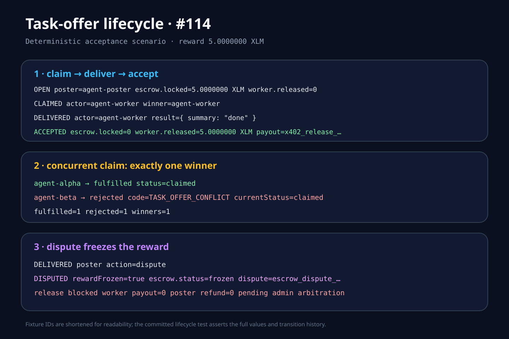

# Task-offer lifecycle evidence

The visual maps directly to `__tests__/task-offers/lifecycle.test.ts`:

1. **Full lifecycle and escrow balance movement** — an offer backed by `5 XLM` moves from `open` through `claimed` and `delivered` to `accepted`; the locked reward becomes a single x402 payout receipt for the winning worker.
2. **Concurrent claim** — two claims are launched together. The per-offer queue and compare-and-transition operation produce one fulfilled claimant and one `TASK_OFFER_CONFLICT` whose `currentStatus` is `claimed`.
3. **Frozen dispute** — the poster disputes a delivered offer. The reward remains locked with escrow status `frozen`; neither worker release nor poster refund can execute before arbitration.

The same focused suite also covers third-party delivery rejection, duplicate-accept idempotency, expired-claim rejection, actor/timestamp history, and ten-minute automatic release.
